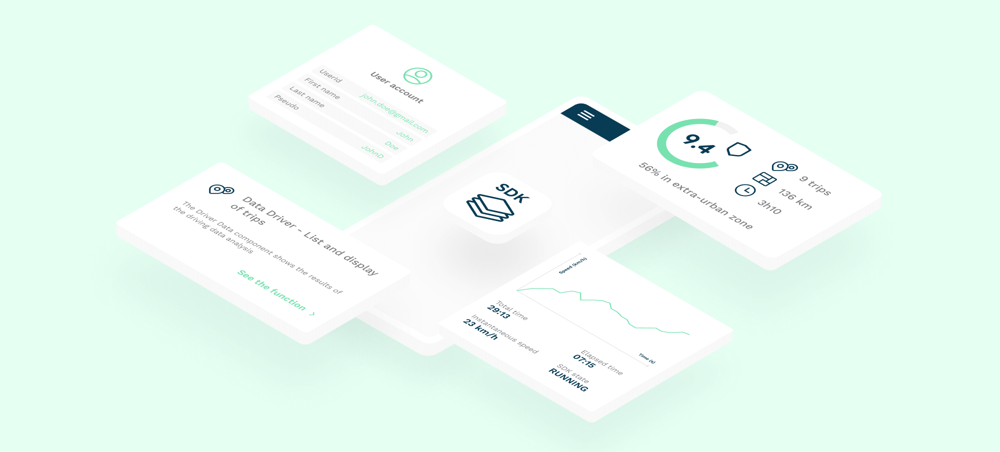

# Introduction

The DriveKit Android quickstart is a simple app that shows you how to integrate the **DriveKit SDK** with the minimum amount of code.

# How to use the Quickstart app?

* Clone the repository and launch the project in Xcode
* In [`MainActivity.kt`](app/src/main/java/com/example/drivekitquickstart/MainActivity.kt), inside the `configureDriveKit()` method:
    * Set your **DriveKit API key** as parameter of the `setApiKey()` method
    * Enter a **userId** as parameter of the `setUserId()` method.
* Then launch the app on your smartphone
    * Click on **"Ask for permissions"** and authorize all necessary permissions
    * Click on **"Configure DriveKit"** to set the api key, user and activate the auto start
* Enjoy your first trips!

# What’s next?

* Discover our [open-sourced DriveKit App Demo](https://github.com/DriveQuantPublic/drivekit-ui-android) which integrates all available DriveKit modules.
* Integrate the DriveKit SDK in your own app by reading the [Quick start page](https://docs.drivequant.com/drivekit/quick-start)
* Fine-tune your DriveKit integration with [advanced configurations](https://docs.drivequant.com/drivekit/get-started-drivekit/android/quick-start).
